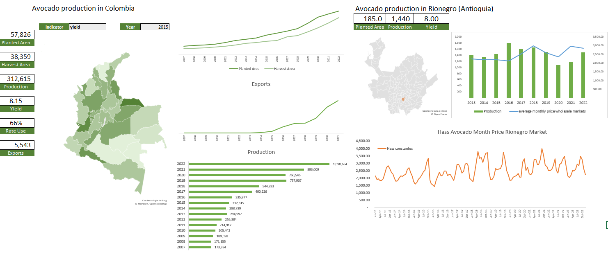
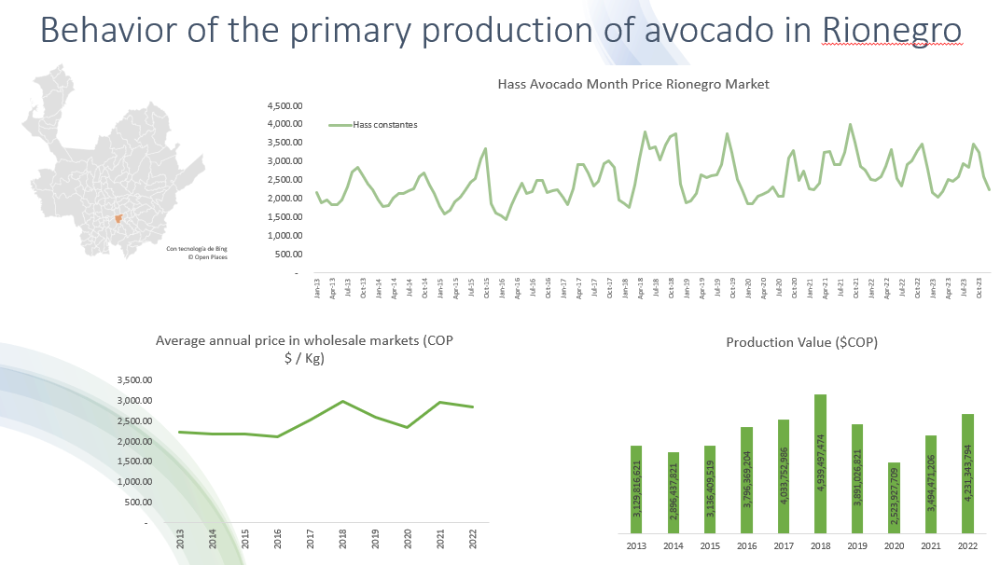
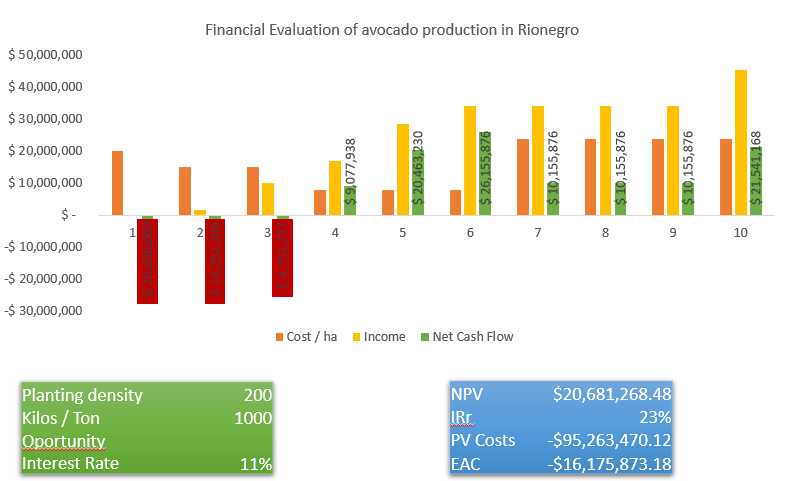
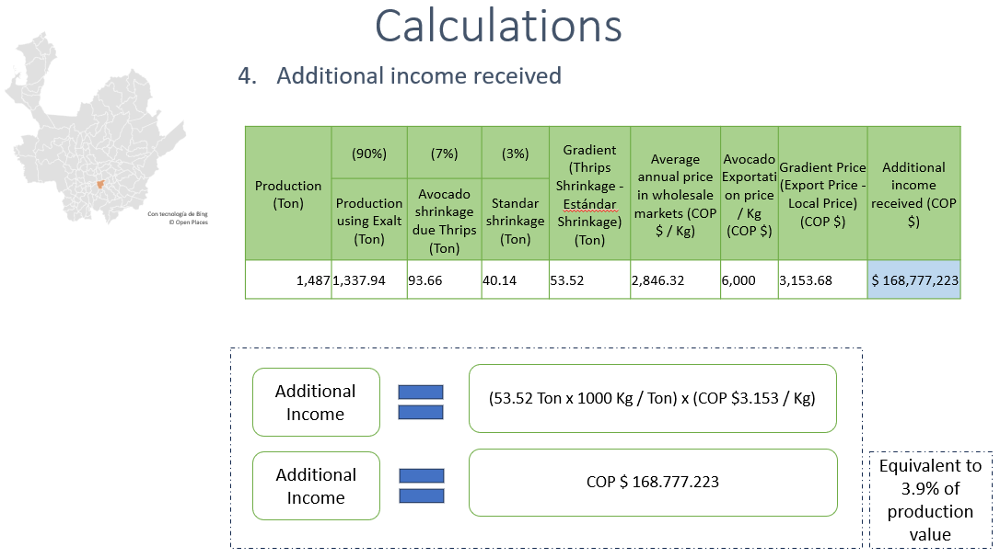

# Market Analysis and Value Chain: Avocado Production in Rionegro, Antioquia
## 📌 Project Overview
This data analysis project evaluates the economic viability and export potential of avocado production in Rionegro, Colombia. By integrating official government datasets with primary field research, the study assesses how technical inputs (phytosanitary products) impact fruit quality, market access, and producer profitability.

## 📊 Methodology & Data Integration
* **Secondary Data:** Processed and analyzed price and volume datasets from **DANE (SIPSA)** to model regional market size.
  
* **Primary Research:** Conducted direct interviews with local producers to establish a realistic baseline for production costs (labor, inputs, and logistics).
* **Phytosanitary Impact Study:** Analyzed the correlation between specific pesticide use and the reduction of export barriers, leading to higher "Export-Grade" price premiums.
  

## 🛠️ Technical Implementation (Excel)
* **Data Modeling:** Developed a relational model to calculate Total Revenue ($Quantity_{DANE} \times Price_{Market}$).  
* **Cost-Benefit Analysis:** Built a comparative scenario tool to measure the **Return on Investment (ROI)** for producers adopting export-standard treatments.
  
 
* **Dashboards:** Created interactive visualizations using Pivot Tables and Power Query to track price volatility and margin distribution.

## 📈 Key Findings & Policy Implications
* **Price Premium:** Products meeting export phytosanitary standards achieved a 110% higher market price compared to domestic-only fruit.
* **Infrastructure & Logistics:** Identified transportation costs as a critical friction point in the Rionegro value chain.
* **Evidence-Based Policy:** The analysis suggests that technical assistance in phytosanitary certification is a more sustainable lever for rural income growth than direct price subsidies.

 

## 📁 Repository Structure
* `/analysis`: Main Excel workbook with data models and dashboards.
* `/data`: Summary of DANE datasets and anonymized producer survey results.
* `/images`: Screenshots of the analytical dashboards.
